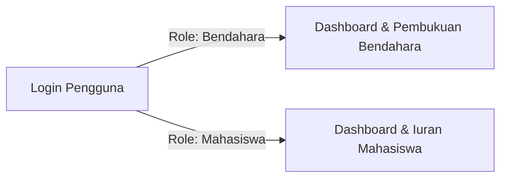
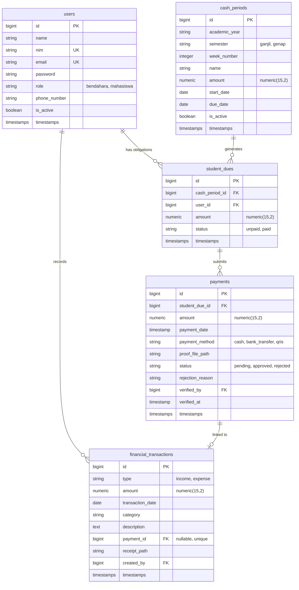

# KASMA &bull; Class Cash Management System

<p align="center">
  
  
  
  
  
  
</p>

---

## 📌 Tentang KASMA

**KASMA (Class Cash Management System)** adalah aplikasi pengelolaan dan transparansi kas kelas berbasis web yang dirancang khusus untuk mahasiswa perguruan tinggi (studi kasus: Kelas TI26A3 Teknik Informatika, Universitas Duta Bangsa Surakarta).

Sistem ini memecahkan permasalahan pencatatan kas kelas konvensional seperti:
- Pengumpulan iuran manual yang sering tercecer dan sulit dilacak.
- Bukti transfer bank/QRIS yang menumpuk di grup obrolan tanpa verifikasi terstruktur.
- Ketidakterbukaan saldo dan arus kas bagi mahasiswa pembayar iuran.
- Pencatatan pengeluaran yang tidak akuntabel tanpa bukti nota fisik/digital.

Dengan KASMA, mahasiswa memiliki akses mandiri untuk menyetor iuran dan memantau transparansi buku kas kelas, sementara bendahara kelas dibekali alat verifikasi, pencatatan tunai, serta pembukuan buku besar otomatis berbasis ledger riil.

---

## 👥 Dua Peran Pengguna (User Roles)

Sistem KASMA dirancang secara ketat hanya untuk **2 peran pengguna** (tidak memiliki peran admin umum):



1. **Mahasiswa**:
   - Melihat status kewajiban iuran kas mingguan berjalan dan riwayat seluruh pekan.
   - Mengajukan bukti setor iuran via Transfer Bank atau QRIS.
   - Memantau status verifikasi (Disetujui, Menunggu, Ditolak dengan alasan).
   - Melihat transparansi penuh arus kas masuk, keluar, dan bukti nota belanja kelas (*read-only*).
2. **Bendahara**:
   - Inisialisasi dan konfigurasi periode kas satu semester (misal 16 pekan).
   - Verifikasi bukti transfer masuk (Setujui atau Tolak dengan alasan wajib).
   - Pencatatan setoran tunai (*cash*) di kelas secara instan tanpa perlu unggah berkas.
   - Pencatatan transaksi manual (pemasukan donasi/sponsor dan belanja pengeluaran kelas dengan unggah nota kuitansi).
   - Manajemen pembukuan dan pemantauan saldo buku besar (*ledger*).

> [!NOTE]
> Otorisasi diperiksa secara ketat di sisi server via middleware `role:bendahara` dan `role:mahasiswa`. Mahasiswa dilarang keras mengakses tindakan manajerial atau mengubah data pembukuan.

---

## 💡 Prinsip Keuangan & Aturan Bisnis (Business Rules)

### 1. Saldo Kas Dinamis Berbasis Buku Besar (Ledger-Based Balance)
Saldo kas dihitung secara dinamis langsung dari tabel buku besar (`financial_transactions`):
$$\text{Saldo Kas Terkini} = \sum \text{Pemasukan (Income)} - \sum \text{Pengeluaran (Expense)}$$
- Sistem **tidak menyimpan** kolom saldo statis/mutabel untuk menghindari anomali inkonsistensi saldo.
- Hanya pembayaran mahasiswa yang telah berstatus **`approved`** yang diakui sebagai transaksi pemasukan kas.

### 2. Transaksi Terikat Pembayaran (Payment-Based Immutability)
- Transaksi pemasukan yang tercipta secara otomatis dari pembayaran mahasiswa terikat permanen melalui kolom `payment_id`.
- Transaksi ini diberi label **"Iuran Siswa (Terkunci)"** dan **tidak dapat diubah atau dihapus sembarangan** secara manual oleh bendahara.
- Bendahara hanya dapat menambah, mengedit, atau menghapus transaksi **manual** (`payment_id = NULL`).

### 3. Integritas Pembayaran & Cegah Duplikasi
- Setiap `StudentDue` memiliki relasi `hasMany(Payment)`.
- Mahasiswa **tidak dapat** mengajukan pembayaran baru jika kewajiban pekan tersebut telah disetujui (`status = 'paid'`) atau sedang dalam status menunggu (`pending`).
- Jika pembayaran sebelumnya **ditolak** (`rejected`), mahasiswa diizinkan mengajukan kembali bukti pembayaran baru.

### 4. Transaksi Atomik Database
Semua aksi keuangan kritis (persetujuan pembayaran, pencatatan tunai, pembuatan transaksi manual) dieksekusi di dalam `DB::transaction`. Jika salah satu proses gagal, seluruh perubahan dibatalkan (*rollback*) untuk menjaga integritas data keuangan.

---

## 🗄️ Skema Database & Relasi Model

Database menggunakan **PostgreSQL** dengan tipe data presisi moneter `numeric(15,2)` dan konstrain integritas relasional:



### Konstrain Unik Utama (Unique Constraints):
- `cash_periods`: `UNIQUE(academic_year, semester, week_number)` &rarr; Mencegah duplikasi pekan dalam satu semester.
- `student_dues`: `UNIQUE(cash_period_id, user_id)` &rarr; Mencegah mahasiswa memiliki kewajiban ganda pada pekan yang sama.
- `financial_transactions`: `UNIQUE(payment_id)` &rarr; Memastikan satu pembayaran mahasiswa hanya menghasilkan satu catatan pemasukan di buku kas.

---

## 🚀 Panduan Instalasi & Menjalankan Proyek

### Prasyarat Sistem
- **PHP** >= 8.2 (dengan ekstensi `pdo_pgsql`, `pgsql`, `mbstring`, `openssl`, `tokenizer`, `xml`, `ctype`, `json`, `fileinfo`)
- **Composer** >= 2.x
- **Node.js** >= 18.x & **npm**
- **PostgreSQL Server** (aktif dan dapat diakses)

### Langkah Pemasangan

1. **Clone Repository**:
   ```bash
   git clone https://github.com/Bintanggz/WEBSITE-KASMA.git
   cd WEBSITE-KASMA
   ```

2. **Install Dependensi PHP & JavaScript**:
   ```bash
   composer install
   npm install
   ```

3. **Konfigurasi Lingkungan (`.env`)**:
   Salin file `.env.example` ke `.env`:
   ```bash
   cp .env.example .env
   ```
   Buka file `.env` dan sesuaikan koneksi database PostgreSQL Anda:
   ```env
   DB_CONNECTION=pgsql
   DB_HOST=127.0.0.1
   DB_PORT=5432
   DB_DATABASE=kasma
   DB_USERNAME=postgres
   DB_PASSWORD=rahasia_anda
   ```

4. **Generate Application Key**:
   ```bash
   php artisan key:generate
   ```

5. **Jalankan Migrasi & Database Seeder**:
   ```bash
   php artisan migrate:fresh --seed
   ```
   *Perintah ini akan membuat seluruh tabel database dan mengisinya dengan data awal:*
   - 1 Akun Bendahara
   - 32 Akun Mahasiswa Kelas TI26A3
   - 16 Periode Kas Semester Genap 2025/2026 (Rp 10.000 / pekan)
   - Riwayat kewajiban iuran, pembayaran uji coba, serta transaksi buku kas.

6. **Build Asset Frontend (Tailwind CSS & Alpine.js)**:
   - Untuk development:
     ```bash
     npm run dev
     ```
   - Untuk produksi:
     ```bash
     npm run build
     ```

7. **Jalankan Server Lokal**:
   ```bash
   php artisan serve
   ```
   Aplikasi dapat diakses melalui browser di: `http://127.0.0.1:8000`

---

## 🔑 Akun Demo Pengujian

Data akun bawaan yang terdaftar setelah menjalankan `php artisan migrate --seed`:

| Peran | Nama | Email / Login | NIM | Password |
| :--- | :--- | :--- | :--- | :--- |
| **Bendahara** | Nadya Putri | `bendahara@kasma.edu` | `220400` | `password` |
| **Mahasiswa** | Hafizh Al-Fatih | `hafizh@kasma.edu` | `220401` | `password` |
| **Mahasiswa** | Farhan Pratama | `farhan@kasma.edu` | `220412` | `password` |
| **Mahasiswa** | Siti Nurhaliza | `siti@kasma.edu` | `220425` | `password` |

> [!TIP]
> Anda dapat login menggunakan **Email** ataupun **NIM** bersama kata sandi `password`.

---

## 🗺️ Peta Navigasi & Rute Aplikasi

### 1. Rute Otentikasi & Publik
- `GET /` &rarr; Redirect cerdas ke dashboard sesuai peran (atau `/login` jika belum masuk).
- `GET /login` &rarr; Halaman masuk (dukungan login via Email atau NIM).
- `POST /login` &rarr; Proses otentikasi sesi.
- `POST /logout` &rarr; Keluar dari aplikasi.

### 2. Berkas Terlindungi (Protected Streaming)
- `GET /payments/{payment}/proof` &rarr; Streaming berkas bukti transfer (akses khusus pemilik pembayaran atau bendahara).
- `GET /transactions/{transaction}/receipt` &rarr; Streaming berkas nota/kuitansi transaksi pembukuan.

### 3. Menu Mahasiswa (`/mahasiswa/*`)
- `GET /mahasiswa/dashboard` &rarr; Dashboard utama mahasiswa (status pekan aktif, progres semester, ringkasan saldo kas).
- `GET /mahasiswa/iuran` &rarr; Halaman iuran kas (daftar seluruh pekan, nominal, status lunas/belum lunas).
- `GET /mahasiswa/riwayat` &rarr; Riwayat setoran pembayaran (detail verifikasi, status, alasan penolakan, tombol setor ulang).
- `POST /mahasiswa/payments` &rarr; Kirim pengajuan pembayaran iuran (Transfer BCA / QRIS + unggah bukti).
- `GET /mahasiswa/keuangan` &rarr; Transparansi kas kelas (*read-only*: saldo terkini, total arus kas, mutasi kas, lihat nota).

### 4. Menu Bendahara (`/bendahara/*`)
- `GET /bendahara/dashboard` &rarr; Dashboard bendahara (fokus saldo kas, target pekan ini, antrean verifikasi, aksi cepat).
- `GET /bendahara/iuran` &rarr; Manajemen periode kas (buat periode 1 semester, aktivasi/deaktivasi pekan).
- `GET /bendahara/iuran/{period}` &rarr; Detail status pelunasan mahasiswa per pekan.
- `GET /bendahara/verifikasi` &rarr; Verifikasi pembayaran transfer/QRIS & pencatatan kas tunai langsung.
- `PATCH /bendahara/payments/{payment}/approve` &rarr; Setujui bukti bayar (atomik mencatat transaksi masuk).
- `PATCH /bendahara/payments/{payment}/reject` &rarr; Tolak pembayaran dengan alasan wajib.
- `POST /bendahara/cash-payments` &rarr; Catat pembayaran tunai langsung di kelas.
- `GET /bendahara/transaksi` &rarr; Buku transaksi kas & pembukuan (filter pemasukan/pengeluaran, tanggal, pencarian).
- `POST /bendahara/transaksi` &rarr; Catat transaksi pemasukan/pengeluaran manual (+ bukti nota).
- `PUT /bendahara/transaksi/{transaction}` &rarr; Edit transaksi manual.
- `DELETE /bendahara/transaksi/{transaction}` &rarr; Hapus transaksi manual.

---

## 🛡️ Keamanan & Perlindungan Data

- **Penyimpanan Berkas Privat**: Seluruh berkas bukti transfer dan kuitansi disimpan pada disk `local` privat (`storage/app/private/`) dan dilayani melalui controller khusus dengan otentikasi stream. Berkas tidak dapat diakses secara publik lewat tautan URL statis.
- **Pencegahan IDOR (Insecure Direct Object References)**: Mahasiswa hanya dapat mengunduh bukti transfer miliknya sendiri. Akses terhadap bukti pembayaran mahasiswa lain akan ditolak dengan respons `403 Forbidden`.
- **Validasi Ketat Form Request**: Validasi menyeluruh terhadap format gambar (`jpg`, `jpeg`, `png`, `webp`), batas ukuran maksimal 5MB, format tanggal, serta nilai mata uang minimum.
- **CSRF Protection**: Seluruh request form dilindungi oleh token CSRF Laravel bawaan.

---

## 🧪 Pengujian Otomatis (Automated Testing)

Proyek dilengkapi dengan pengujian fitur (*Feature Tests*) menggunakan PHPUnit yang mencakup 64 skenario pengujian menyeluruh:

```bash
# Menjalankan seluruh rangkaian test
php artisan test
```

### Modul Test yang Tercakup:
1. **`AuthenticationTest`**: Otentikasi email/NIM, proteksi peran, redirect dashboard, proteksi user nonaktif.
2. **`DatabaseArchitectureTest`**: Integritas konstrain unik, pencegahan duplikasi iuran, perhitungan saldo kas riil.
3. **`WeeklyCashPeriodTest`**: Pembuatan paket periode satu semester, aktivasi pekan, pembentukan otomatis kewajiban mahasiswa.
4. **`MahasiswaPaymentTest`**: Validasi unggah bukti transfer, cegah duplikasi bayar, proteksi hak akses mahasiswa.
5. **`PaymentVerificationTest`**: Alur verifikasi bendahara, atomisitas persetujuan (pembayaran lunas + pemasukan ledger), penolakan dengan alasan, pencatatan tunai.
6. **`FinancialTransactionsTest`**: Perhitungan saldo murni dari ledger, filter pembukuan, CRUD transaksi manual, proteksi transaksi pembayaran terkunci, transparansi mahasiswa.

---

## 🎨 Desain Antarmuka

Antarmuka KASMA dibangun dengan mengedepankan prinsip:
- **Clean & Professional**: Palet warna netral berbasis slate/stone dengan aksen emerald untuk status lunas/pemasukan dan rose untuk tunggakan/pengeluaran.
- **Mobile-First**: Dilengkapi laci menu samping (*drawer*) dan navigasi bawah (*bottom bar*) responsif yang disesuaikan per peran pengguna saat dibuka dari smartphone.
- **Bebas Distraksi**: Menghindari animasi berlebihan, efek kaca (*glassmorphism*) berlebih, atau elemen dekoratif yang tidak fungsional.

---

## 📄 Lisensi

Proyek KASMA dikembangkan untuk keperluan akademik dan manajemen kas kelas berbasis open-source di bawah lisensi [MIT License](LICENSE).
